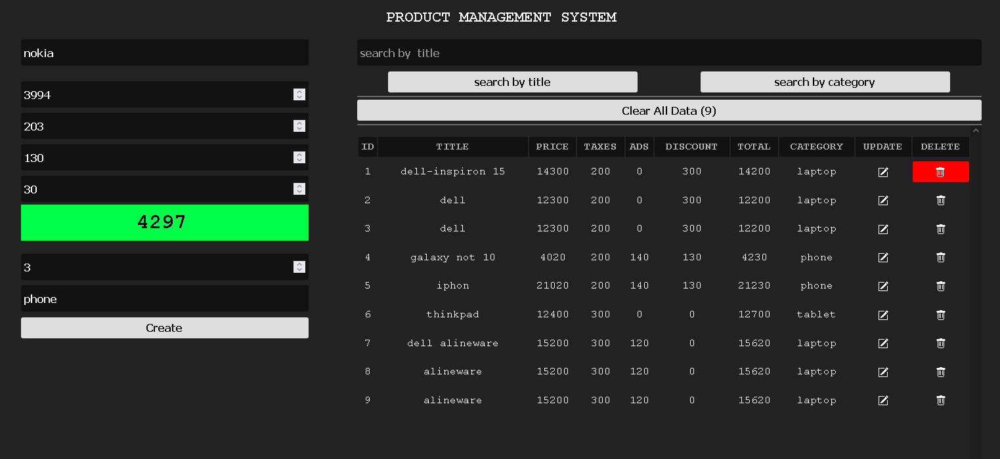

# Product Management System (CRUDS Operations)

- A simple product management system allows you to add product Title, Price, Taxes, Ads, Discount, Quantity of products in stock, and Product Category
- **`Creat`** or **`delete`** or **`update`** product info
- **`Search`** the product by **Title** or **Category**
- Store all product info in Local Storage
- Show how many items are in Local Storage

## Built With

- HTML
- Css
- JavaScript
- LocalStorage

## Live Demo ([Go Live](https://muhmmdusama.github.io/Product-Management-System-CRUDS-Operations-/))

## Authors

##👤 Author

- GitHub: [@muhmmdusama](https://github.com/muhmmdusama)
- Twitter: [@muhmmdusama](https://twitter.com/muhmmdusama)
- LinkedIn: [muhmmdusama](https://linkedin.com/in/muhmmdusama)

## 🤝 Contributing

Contributions, issues, and feature requests are welcome!

## Show your support

Give a ⭐️ if you like this project!

## 📝 License

This project is [MIT](./MIT.md) licensed.
